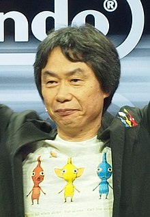
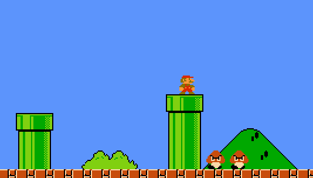

# Platformer - Part 1

(Note: Part 1 is quite large! Get started early! Part 2 will mostly be polish and AI. Part 3 will be the final game)

## The Business

The gaming business is a volatile business. It is volatile because it changes and moves forward, innovates, and then the cycle repeats. The good news is that your team has made millions from the success of breakout. You have successfully completed your contract with your old boss and your companies getting positive publicity.

This time however, you have caught the attention of another game designer: Shigeru Miyamoto

## Shigeru Miyamoto


Shigeru Miyamoto is the legendary game designer of Donkey Kong, Mario and several other Nintendo franchises. Miyamoto does not care about fancy graphics, he only wants to make sure the game is fun. 

Read more about Shigeru Miyamoto here: https://en.wikipedia.org/wiki/Shigeru_Miyamoto

For inspiration during this project, it may be worthwhile to discuss with your team you favorite Nintendo game. :)

## Platformer Games

For this series of assignments, we are going to build a 2D platformer game. Platformer games are games in which you typically run, jump, and battle bad guys in real time. The specific type of platformer we are going to develop is 2D and a [side scroller](https://en.wikipedia.org/wiki/Side-scrolling_video_game).

- Step 1 - Play the game!
  - If you are unfamaliar with Mario or platformer games, you can play a version here:
  - http://supermarioemulator.com/mario.php
- Step 2 - Form a team!
  - https://docs.google.com/spreadsheets/d/1bglePE3sfvoe5yCSCp8BKBt8lg0e9SQcGptQPyVkkTU/edit?usp=sharing
  - Make sure you form a team! (If you are reading this, make sure your teammates join your same repository)
- Step 3 - Game Design
  - Miyamoto focuses on fun and on developing franchisable characters (think about how many Mario games there have been!). What makes a game fun or memorable is a difficult question and often involves much trial and error! For us however, we only have a few weeks to complete the contract for this game.

For that reason we are going to focus on:

* Building tools that can be reused (A sprite editor and tilemap editor) to speed up the develpment of our game.
* Implementing 1 special technique/powerup/gameplay feature that makes our game unique

## Our technology stack

Shigeru has decided that you will be using the following technology stack:

* Modern C++ (11/14/17)
* SDL library

Miyamoto prefers these tools because SDL is an industry standard, cross platform, and using C++ will give us some additional speed. 

Nintendo however likes to do things there own way. Perhaps there will be some surprises in the future! Program your project accordingly.

## Game Requirements

The platform game you are building in part 1 has the following requirements.

- There should be 1 music track that plays in the background
- You should have an animated sprite for the main character.
- Your character should be able to run and jump (arrowkeys and spacebar or WASD and spacebar)
- There should be tiles that a character can run on and jump over
  - That means you should think about a 2D collision system
- There should have some 'background' image (i.e. clouds in the sky, mountains, a blue gradient, etc) in your world.
- You should think about 'enemy characters' (This will be implemented in part 2)
- You should think about a 'special feature' or gameplay mechanic that makes your game unique.
- There should be a tile editor (see next section)
- You should include a sprite editor (see next section)

### Tile Editor
A tile editor is a simple tool that allows you to place, select, and draw tiles to preview your level.

- Your tile editor should let you add different tiles
- Your tile editor should let you delete different tiles
- Your tile editor should support loading previously created maps
- Your tile editor should support saving previously created maps

A simplistic tile editor may be think of a tile map is a collection of values stored in an array

```
0 0 0 0 0 0 0 0 
0 0 0 0 0 0 0 0
0 0 0 2 0 1 0 0
2 2 2 2 2 2 2 2
```
0 = empty space (no tiles, this is where the background image will show)
1 = some enemy character
2 = some tile

If I click within some x and y coordinates, that increments or decrements the value and changes the tile. This is considered an acceptable version of a tile editor for this assignment.

You may use any language (Python, C++, C#, etc.) to implement your tile editor. It need not have a fancy GUI, but that is encouraged as time permits

Here is some inspiration for building a tile editor

* V-Play editor https://www.youtube.com/watch?v=65SQoW2Jd94 
* Dev blog showing an editor https://www.youtube.com/watch?v=nnm2ARAcSJ0

### Sprite Editor

A sprite editor is a tool that can allow you to slice a single sprite sheet into various animations.

Your sprite editor needs the following functionality.

- Specify dimensions of how big each tile is.
- Be able to preview an arbitrary number of frames

A simplisitic sprite editor may be a terminal based tool that loads an image, asks you the dimensions of a sprite, and then which frames to play.  This is considered an acceptable version of a tile editor for this assignment.

Here is some inspiration for building a (fancy) sprite editor:

* https://www.youtube.com/watch?v=8bKCdmgJnPM

You may use any language (Python, C++, C#, etc.) to implement your tile editor. It need not have a fancy GUI, but that is encouraged as time permits.

### Game

Beyond those requirements, you may get as creative as you like.

Tips:
* Start early and stay on track for each milestone!

## Rubric (8% of overall grade)

<table>
  <tbody>
    <tr>
      <th>Points</th>
      <th align="center">Description</th>
    </tr>
    <tr>
      <td>20% (Core Requirements)</td>
      <td align="left">Core - Your code <b>must</b> compile using 'python build.py' and work on the first try. Try putting it on a clean machine before submitting to see if this works on your development operating system.</td>
    </tr>    
    <tr>
      <td>20% (Core Requirements)</td>
      <td align="left">Core Is their good programming style(classes, OOP), was their only 1 commit right before the deadline? Did everyone make at least one commit in the project. Did you organize your project in the appropriate folders.</td>
    </tr>
    <tr>
      <td>30% (Game Requirements)</td>
      <td align="left">The Game requirements should be met above.</td>
    </tr>
    <tr>
      <td>30% (Polish)</td>
      <td align="left">The game and editors should feel polished and work.</td>
    </tr>
  </tbody>
</table>

**Note: Everyone on your team earns the same grade for all parts of the project.**

## More Resources and Assets

* https://wiki.libsdl.org/APIByCategory
* Free platformer tile assets
  * Jungle https://assetstore.unity.com/packages/2d/environments/2d-jungle-side-scrolling-platformer-pack-78506
  * Platfomer https://assetstore.unity.com/packages/2d/environments/2d-dev-sprites-14602
  * Flappy bird like assets: https://assetstore.unity.com/packages/2d/characters/sprite-pack-1-tap-and-fly-21454
  * Mario sprite sheet search (use with attribution): https://www.google.com/search?q=mario+sprite+sheet&rlz=1C1CHBF_enUS770US770&source=lnms&tbm=isch&sa=X&ved=0ahUKEwiv9dL_-7TZAhVNneAKHVWbDgEQ_AUICigB&biw=1440&bih=769#imgrc=_
