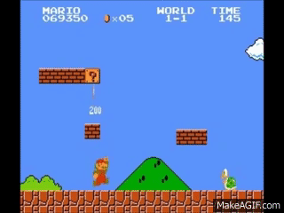

# Platformer - Part 2

# The X-Factor

Shigeru Miyamoto is impressed with the progress on your platformer. He has in fact never seen so much done so quickly! He thinks the tools you have developed should help create a very polished game and help you iterate much more quickly. He suggests something is missing, some sort of "X-Factor" that will make your game stand out from all the other platformers.

## Part 2 - Task 1- Special Mechanic

> From part 1 *You should think about a 'special feature' or gameplay mechanic that makes your game unique.*

Your first task for part 2 will be implmementing this 'special feature' that makes your game unique. Examples of games that have had special techniques or features include [Portal](https://www.youtube.com/watch?v=TluRVBhmf8w) or in [Braid](https://www.youtube.com/watch?v=uqtSKkyJgFM) the ability to control time. These single features alone spawned a unique game framework (as well as multiple copycat games!).

### Your Task

Brainstorm with your teammates some game mechanic, graphical effect, or sound effect that makes not only your game unique, but your 'game engine' have a special feature and competitive edge against others.

Some ideas of unique game mechanics.
- A fancy graphical effect with lighting
- Implementing a parallax scrolling system
- If a powerup is hit, perhaps the world changes
  - Because we are using tilemaps, perhaps every tilemap has a corresponding tile that also changes (i.e. a day and night version of your tiles could be one example, or winter and summer)
- Procedurally generated tilemaps.
- A character who can fly or float.
- Music or sound effects are played (or sped up) based on some action.

The idea is that you do something creative here!

## Part 2 - Task 2 - Enemy AI

> From part 1 *You should think about 'enemy characters' (This will be implemented in part 2)*

To make a platformer more engaging, there should be some enemy charaters! Enemies in platformers are typically characters that you can eliminate by jumping on top of them. If the enemy however runs into you first, then your character loses a life (or otherwise it is game over if only one life is given)!

### Your Task

Add enemy AI into your system.

1. Enemies should move back and forth along some path.
	-  Enemies do not move through tiles (unless they are specifically ghosts!).

The goal here is to implement your enemy AI system. Nothing complex, just get enemies that work!

## Part 2 - Task 3 - Core

We do not want to forget about topics we have previously learned about!

1. Implement frame capping on your platformer to ensure a smooth experience! 
	- You must print out the frame rate somewhere on your game (the console or otherwise the screen) so we can validate it is working. 
	- You may document a way to toggle the display of the framerate if you like.
2. You must have a resource manager
	- This time we are potentially working with more textures, and likely multiple copies of them. You must have a resource manager (even if you only load one spritesheet--remember you are building an engine that can scale in the future!).

## Rubric (8% of overall grade)

<table>
  <tbody>
    <tr>
      <th>Points</th>
      <th align="center">Description</th>
    </tr>
    <tr>
      <td>20% Core Requirements Feature</td>
      <td align="left">Is your game frame capped and can we see or toggle the framerate? (10%) Did you implement a Resource Manager? (10%)</td>
    </tr>    	  
    <tr>
      <td>40% Special Feature (X-Factor)</td>
      <td align="left">Implement a special feature. You will document it in more detail in part 3. This section is graded with some focus on the creativity and how well engineered the feature is.</td>
    </tr>    
    <tr>
      <td>40% Are there enemies? </td>
      <td align="left">(And do they collide and interact properly with the world. Can a player reliably eliminate them, or if not eliminate them, does the player collide with enemies and lose the game appropriately?)</td>
    </tr>
  </tbody>
</table>
